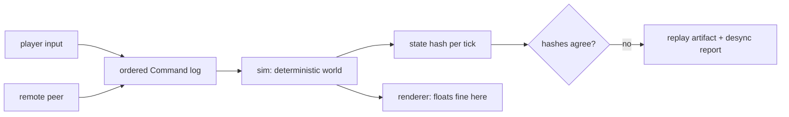

# 00 — Overview

**Placeholder.** This doc will hold the pitch: what the player does, what the
match looks like, and how the numbered docs divide the design. None of that is
decided. What follows is only the shape the corpus is set up to receive, so the
first real design pass has somewhere to land.

Unlike the other numbered docs, `00-overview.md` stays a single file — it is
short by construction, and splitting a pitch defeats it.

## What is fixed already

Exactly two things, and both are architectural rather than design:

1. **The game is lockstep multiplayer.** Every peer runs the same simulation and
   exchanges only ordered commands. This is the constraint that generates
   CLAUDE.md's determinism rules, and it is expensive to reverse — a sim built
   without it does not become deterministic later.
2. **`sim` is renderer-free plain Rust.** Whatever renders the game talks to the
   sim through commands and reads its state; it never writes state.

The diagram is also the reason the crate boundary is worth its inconvenience:
the arrow from `render` back to `sim` does not exist, and any commit that draws
one is the architecture violation to catch in review.

## What the numbered docs will hold

Reserved, not written. The numbering is deliberately sparse so that a topic can
be inserted without renumbering:

| Doc | Owns |
|---|---|
| `01` | The unit language — syntax, execution model, cost model |
| `02` | Units — what they are, what they sense, what they do |
| `03` | The world — terrain, resources, whatever the economy turns out to be |
| `04` | Opposition — PvE, PvP, or both |
| `05` | Progression |
| `06` | Architecture — crates, tick loop, netcode, testing strategy |

Each becomes a doorway plus a parts directory only when it outgrows one file
(CLAUDE.md, *Splitting a doc*).

## Where to start

[QUESTIONS.md](QUESTIONS.md) lists the questions in dependency order. The first
one — what the player actually programs — determines most of the rest, so it is
worth being slow about.
