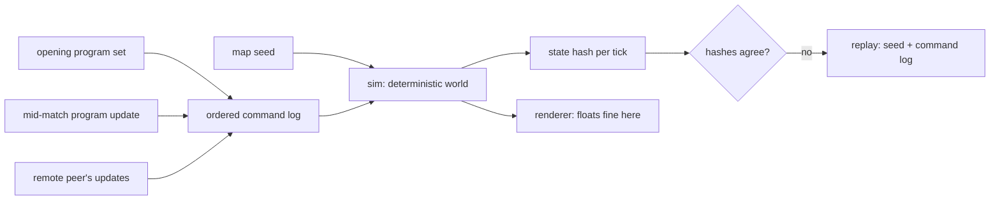

# 00 — Overview

A lockstep-multiplayer programming game. The player writes a small number of
programs and a fleet of identical units runs them — and when a program turns out
to be wrong, the player rewrites it while the match is still running. Watching a
plan meet the world, and patching it under fire, is the game.

Unlike the other numbered docs, `00-overview.md` stays a single file — it is
short by construction, and splitting a pitch defeats it. It owns the
pitch-level rulings below and nothing more specific; as `01`–`06` get written,
rulings that belong to them move there.

## Architecture, fixed before the design

Two things were settled before any design question was asked, and neither is
reopened by this corpus:

1. **The game is lockstep multiplayer.** Every peer runs the same simulation and
   exchanges only ordered input. This is the constraint that generates
   CLAUDE.md's determinism rules, and it is expensive to reverse — a sim built
   without it does not become deterministic later.
2. **`sim` is renderer-free plain Rust.** Whatever renders the game reads sim
   state and never writes it.

The diagram is why the crate boundary is worth its inconvenience: the arrow from
`render` back to `sim` does not exist, and any commit that draws one is the
architecture violation to catch in review.

Note the shape of the arrows that *do* reach the sim. Player edits and a remote
peer's edits enter by the same road — the ordered command log — and neither
reaches the world any other way. That single funnel is what makes a mid-match
program update synchronizable at all: an update is agreed for a future tick, so
every peer holds it before that tick runs. There is deliberately no arrow from
the player to an individual unit.

## Decided

Rulings this doc owns. Each is normative — an implementer builds from this
section. The reasoning behind each, and the options rejected, live in
[history/questions-answered/](history/questions-answered/README.md) — one file
per ruling, each carrying the worksheet behind it. Don't read those in a normal
pass.

- **This is a fresh take on the predecessor project's core idea (Q1).** Lockstep
  multiplayer, player-programmed units, deterministic plain-Rust sim. The
  architecture is inherited and already proven in CI; the game around it is
  re-decided, and so is the corpus discipline that holds it.
- **The player programs a fleet of identical units (Q2).** Many units, few
  programs. Programs are addressed to a role or group, never to an individual
  unit, so the language needs no unit-identity concept in its core. Difficulty
  is sourced from interaction between copies rather than from authored puzzles.
- **The player updates programs while the match runs, and never orders an
  individual unit (Q3).** A program update is a lockstep-synchronized command,
  agreed for a future tick so every peer applies it on the same tick. Updates
  are to programs, which by Q2 address a role or group. Whether anything
  *besides* a program update — match control such as resigning — enters the sim
  mid-match is open (Q10); this ruling forbids unit orders, not that. So
  `Command` is a real ordered log whose principal variant is a program deploy, a
  replay is `(seed, timed command log)`, and determinism rule 7 is load-bearing:
  which byte-exact program version a unit runs is part of the state hash.
- **The unit language's rulings live in [01-language](01-language.md)** — Q5
  and Q13 (the boundary), Q8, Q11, Q16, Q17, Q18 and Q20 (execution and
  interrupts) and Q14 and Q19 (numbers) are the Decided entries of the parts
  that elaborate them, and they are not repeated here.
- **A unit senses by vision and by sound, and everything sensed is shared
  across its player's units (Q7).** Units come in kinds — `bot`, and several
  kinds of building — and each kind has a vision range and a hearing range,
  tuning constants in data. Distance is squared Euclidean in `num` against a
  squared range. Vision is state: a unit sees what is within its range and in
  line of sight, and `docs/03` pins what blocks sight and the ray-walk. Sound
  is a record of events: a noisy action emits a sound at the actor's position
  with a loudness from its cause, heard by any unit whose hearing range plus
  that loudness covers the distance, through terrain, and a hearing query
  returns the previous tick's sounds. A query from any unit returns the union
  of what every unit of its player senses, each thing once, sightings sorted
  by distance then entity id and sounds by distance, position and cause.
  The live list is computed at query time from the world and never stored,
  so the state hash carries none of it; what the colony *remembers* is Q21's
  table, which is stored. A sighting carries the sighted unit's
  attributes as `docs/02` defines them; a sound carries its cause, position,
  loudness and tick, never its emitter. Whether a sound can also interrupt a
  program was Q16, which ruled it cannot: programs poll. Whether the colony
  remembers what it no longer senses is Q21's bullet below. This ruling moves
  to `docs/02` when it is written.
- **The colony remembers tiles, not units (Q21).** The world is a grid of
  tiles, and for each player every tile is unknown, visible, or remembered as
  it was on the tick it was last seen. A remembered tile holds the terrain
  and any building on it with its attributes, and the tick — never a bot,
  which is only ever a live sighting. After every unit's slice and before the
  tick's state hash, the sim computes each player's visible tiles and
  refreshes their snapshots, so a tile that leaves vision keeps its last one.
  Memory has no expiry and belongs to the player: nothing clears it until the
  match ends, a destroyed building stays remembered until its tile is seen
  again, and sound is never remembered. A tile query returns the live tile if
  visible, the snapshot with its tick if remembered, and nothing at all if
  unknown; tiles sort by row then column. The memory table, per player and
  per tile, is the first sensing data in the state hash. `docs/02` names the
  queries, `03` says what a tile and its terrain are, `06` places the pass in
  the tick loop. This ruling moves to `docs/02` when it is written.
- **Bots are printed by a printer, buildings are built by bots, and a match
  starts with one printer per player (Q9).** There is no fixed roster.
  Production is ordinary program behavior: the printer is a building kind
  whose program calls a `print` builtin with the role the new bot runs, and
  a bot's program calls a `build` builtin with a building kind and a tile.
  All bots are one kind; what differs is the role. A print or a build takes
  time and costs resources, both tuning, and one the unit cannot afford is a
  `ValueError` fault. A printed bot appears on a tile adjacent to the printer
  on the tick the print completes, running its role's current bundle from the
  top; printing a role with no bundle is a fault. The opening program set is
  the command log's first entries, one deploy per role agreed for tick 0; a
  unit whose role has no bundle runs the empty program, which restarts once
  per tick and is not a state. The building list is `docs/02`'s table,
  seeded with the printer; the rest, and the resources that price it, are
  Q22. This ruling moves to `docs/02` when it is written.
- **PvE ships before PvP (Q4).** Lockstep is built now regardless, since it is
  not retrofittable, so deferring PvP costs nothing architecturally and buys
  slack on balance while the sim changes fastest.

## What the numbered docs will hold

`01` is written; the rest are reserved, not written. The numbering is
deliberately sparse so a topic can be
inserted without renumbering:

| Doc | Owns | Blocked on |
|---|---|---|
| `01` | The unit language — syntax, execution model, cost model | — |
| `02` | Units — what they are, what they sense, what they do | — |
| `03` | The world — terrain, resources, whatever the economy turns out to be | Q22 |
| `04` | Opposition — PvE now, PvP later | — |
| `05` | Progression | — |
| `06` | Architecture — crates, tick loop, netcode, testing strategy | Q6, Q10, Q12, Q15 |

Each becomes a doorway plus a parts directory only when it outgrows one file
(CLAUDE.md, *Splitting a doc*).

## Where to go next

[QUESTIONS.md](QUESTIONS.md) holds what is still open — in numeric order, since
numbering is append-only, so it is not a reading order. The table above is the
map from question to doc. **`01` is written** — [01-language](01-language.md)
— and the table above, not this sentence, is the authority on what blocks the
rest: earlier passes misread `01` as having a single blocker while it had
three.
