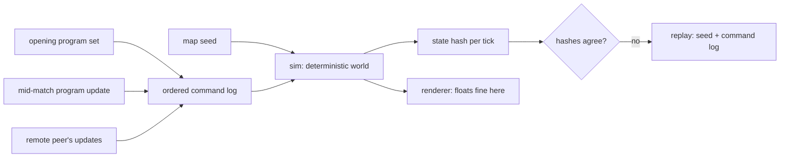

# 00 — Overview

A lockstep-multiplayer programming game. The player writes a small number of
programs and a fleet of identical units runs them — and when a program turns out
to be wrong, the player rewrites it while the match is still running. Watching a
plan meet the world, and patching it under fire, is the game.

Unlike the other numbered docs, `00-overview.md` stays a single file — it is
short by construction, and splitting a pitch defeats it. It owns the
pitch-level rulings below and nothing more specific; as `01`–`06` get written,
rulings that belong to them move there.

## Architecture, fixed before the design

Two things were settled before any design question was asked, and neither is
reopened by this corpus:

1. **The game is lockstep multiplayer.** Every peer runs the same simulation and
   exchanges only ordered input. This is the constraint that generates
   CLAUDE.md's determinism rules, and it is expensive to reverse — a sim built
   without it does not become deterministic later.
2. **`sim` is renderer-free plain Rust.** Whatever renders the game reads sim
   state and never writes it.

The diagram is why the crate boundary is worth its inconvenience: the arrow from
`render` back to `sim` does not exist, and any commit that draws one is the
architecture violation to catch in review.

Note the shape of the arrows that *do* reach the sim. Player edits and a remote
peer's edits enter by the same road — the ordered command log — and neither
reaches the world any other way. That single funnel is what makes a mid-match
program update synchronizable at all: an update is agreed for a future tick, so
every peer holds it before that tick runs. There is deliberately no arrow from
the player to an individual unit.

## Decided

Rulings this doc owns. Each is normative — an implementer builds from this
section. The reasoning behind each, and the options rejected, live in
[history/questions-answered/](history/questions-answered/README.md) — one file
per ruling, each carrying the worksheet behind it. Don't read those in a normal
pass.

- **This is a fresh take on the predecessor project's core idea (Q1).** Lockstep
  multiplayer, player-programmed units, deterministic plain-Rust sim. The
  architecture is inherited and already proven in CI; the game around it is
  re-decided, and so is the corpus discipline that holds it.
- **The player programs a fleet of identical units (Q2).** Many units, few
  programs. Programs are addressed to a role or group, never to an individual
  unit, so the language needs no unit-identity concept in its core. Difficulty
  is sourced from interaction between copies rather than from authored puzzles.
- **The player updates programs while the match runs, and never orders an
  individual unit (Q3).** A program update is a lockstep-synchronized command,
  agreed for a future tick so every peer applies it on the same tick. Updates
  are to programs, which by Q2 address a role or group. Whether anything
  *besides* a program update — match control such as resigning — enters the sim
  mid-match is open (Q10); this ruling forbids unit orders, not that. So
  `Command` is a real ordered log whose principal variant is a program deploy, a
  replay is `(seed, timed command log)`, and determinism rule 7 is load-bearing:
  which byte-exact program version a unit runs is part of the state hash.
- **The unit language is ours, Python-shaped, deterministic by construction
  (Q5).** A purpose-built interpreter rather than an embedded runtime — not
  because an embedded one failed, but because owning it means determinism is
  designed in rather than audited for, the cost model is a design lever, and no
  dependency can change evaluation order under a checked-in replay hash. It is
  Python's *surface syntax*, not CPython's semantics.
- **The subset is broad (Q13).** Procedural Python — functions, control flow,
  collections, comprehensions, the expression grammar — plus `class`, `set`,
  `match` and `import`. Excluded: generators (implementation cost); dynamic
  reflection (permanently, since it defeats static analysis and makes the module
  graph dynamic); decorators, `with` and `async`/`await` (grammar for use cases a
  unit program does not have); nested `def`, `global` and `nonlocal`, which
  removes closure capture as a question while leaving `lambda` and methods in a
  `class` body; multiple inheritance; and floats, which rule 2 forbids in
  state-affecting paths anyway and which Q14 replaces with `fixed`. `try`/`except` was deferred to Q8,
  which admits it — see that bullet.

  Three additions are only deterministic once we diverge from Python, and these
  are normative: **`set` iterates in insertion order** (and its operators
  preserve that order — without this, `set` is a rule-3 violation wearing
  familiar syntax); **`import` resolves within a closed module set**, which makes
  a program a bundle of named files hashed in sorted name order (determinism rule
  7) with circular imports rejected at load; and **`class` dispatches a closed
  dunder set**, named in `docs/01`, since an open-ended dunder protocol is an
  open-ended determinism surface. `match` needs no divergence: arms are tested
  top to bottom, which is Python's rule already.

  Familiarity is the point of choosing Python at all, so the
  divergence list, not the exclusion list, is what a player has to read. This
  boundary is sound because a hot-swap clears all variables, which Q11 made so;
  a swap that ever resumed instead would reopen it. The number model is Q14's
  bullet below.
- **An uncaught exception is an interrupt (Q8).** A unit runs in main flow
  until an interrupt is delivered. A handler is a locked system prologue, the
  player's code, then a locked system epilogue that runs unconditionally —
  whether the player's code returned, faulted, ran out of budget, or was
  preempted. Interrupt kinds are a closed, totally ordered set, and higher
  priority always takes effect: the preempted handler is abandoned, never
  resumed, so there is no handler stack. The kinds, highest first, are `death`
  and `dying` (Q17), `fault` (this ruling) and `redeploy` (Q11). `fault` is an
  exception nothing caught; its hook `on_fault(e)` runs to completion and its
  epilogue restarts main flow from the top with all variables cleared. A unit
  with no `on_fault` halts, visibly, until the next redeploy — there is no
  system default. A fault inside `on_fault` escalates to `dying`.
  `try`/`except`/`raise` are in, Python-shaped. Nothing resumes across an
  interrupt, which is what keeps Q13's boundary intact; pushed world events,
  which would resume, are Q16. The mechanism is `docs/01`'s; what each prologue
  and epilogue does is `docs/02`'s.
- **Death is two kinds, and every hook has a budget (Q17).** `dying` is where
  last words live: its hook `on_dying()` may act within what `docs/02` allows,
  and its epilogue raises `death`. `death` has no hook — prologue, epilogue,
  and the unit leaves the world — so nothing the player writes can delay or
  handle it. The world raises `dying` in the ordinary case and `death` directly
  when things are bad enough; which causes are which is `docs/02`'s list. Every
  hook — a handler's player code — has a total operation budget per invocation,
  a tuning constant `docs/01` pins; exhausting it abandons the code and runs the
  epilogue. So a handler holds off a lower-priority interrupt by at most its
  budget, and a fault inside `on_dying` is absorbed.
- **A redeploy is an interrupt (Q11)** — the lowest kind, `redeploy`, below
  `fault`, and the one with no player hook. The role's program slot changes on
  the tick Q12 agrees; each unit takes the interrupt at its own next operation
  boundary, and the boundary before the first operation counts. The epilogue is
  the swap: the unit takes its role's current program, every variable is
  cleared, and main flow restarts from the top. A unit inside a handler finishes
  that handler first, which Q17's hook budget bounds; a halted unit takes the
  swap at the start of its next slice. Nothing survives a swap, which
  discharges the dependency Q13's boundary carried.
- **Two numeric types, `int` and `fixed`, and no float (Q14).** `int` is a
  64-bit signed integer. `fixed` is a 64-bit signed integer scaled by 10⁶ — six
  decimal places, no infinity, no NaN — and `float` is not a name in the
  language: a literal with a decimal point or an exponent is a `fixed`, and one
  the type cannot represent exactly is rejected at parse time. Overflow of
  either type, division by zero, and a `fixed` exponent are all faults (Q8).
  `/` returns a `fixed` whatever its operands, so `7 / 2` is `3.5` as a Python
  programmer expects; `//` and `%` floor with Python's semantics; an `int` in
  mixed arithmetic promotes exactly to `fixed`; and every `fixed` result that is
  not representable rounds toward negative infinity — one rounding rule, the
  one `//` already has. Conversions, `bool`, and the numeric builtins follow
  Python with `fixed` in place of `float`. The scale is language spec stated
  once in `docs/01`, not a tuning constant, because it decides every replay
  hash.
- **PvE ships before PvP (Q4).** Lockstep is built now regardless, since it is
  not retrofittable, so deferring PvP costs nothing architecturally and buys
  slack on balance while the sim changes fastest.

## What the numbered docs will hold

Reserved, not written. The numbering is deliberately sparse so a topic can be
inserted without renumbering:

| Doc | Owns | Blocked on |
|---|---|---|
| `01` | The unit language — syntax, execution model, cost model | — |
| `02` | Units — what they are, what they sense, what they do | Q7, Q9 |
| `03` | The world — terrain, resources, whatever the economy turns out to be | Q7 |
| `04` | Opposition — PvE now, PvP later | — |
| `05` | Progression | — |
| `06` | Architecture — crates, tick loop, netcode, testing strategy | Q6, Q10, Q12, Q15 |

Each becomes a doorway plus a parts directory only when it outgrows one file
(CLAUDE.md, *Splitting a doc*).

## Where to go next

[QUESTIONS.md](QUESTIONS.md) holds what is still open — in numeric order, since
numbering is append-only, so it is not a reading order. The table above is the
map from question to doc. **Nothing blocks `01` any more** — T8 writes it — and
the table above, not this sentence, is the authority on what blocks what:
earlier passes misread `01` as having a single blocker while it had three.
