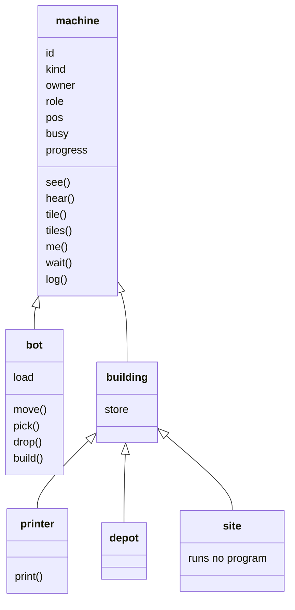

# 02 — Machines

What a machine is, what it senses, and what it does. A machine is a bot or a
building, with a kind, an owner, a role and a program; it senses through two
queries and acts through a handful of builtins, every one of which is a row
in the cost table. This doc is what the game half of the language crate is
built from, and it is normative: two implementers reading it must produce
the same tick-by-tick behavior (design-invariant DI7). The language itself is
[01-language](01-language.md); this doc names the builtins that language
calls the game's own.

## Decided

Rulings this doc owns, moved here from the overview when it was written.
Q22's is shared with `docs/03`, which will cite it.

- **A machine senses by vision and by sound, and everything sensed is shared
  across its player's machines (Q7).** Machines come in kinds — `bot`, and several
  kinds of building — and each kind has a vision range and a hearing range,
  tuning constants in data. Distance is squared Euclidean in `num` against a
  squared range. Vision is state: a machine sees what is within its range and in
  line of sight, and `docs/03` pins what blocks sight and the ray-walk. Sound
  is a record of events: a noisy action emits a sound at the actor's position
  with a loudness from its cause, heard by any machine whose hearing range plus
  that loudness covers the distance, through terrain, and a hearing query
  returns the previous tick's sounds. A query from any machine returns the union
  of what every machine of its player senses, each thing once, sightings sorted
  by distance then entity id and sounds by distance, position and cause. The
  live list is computed at query time from the world and never stored, so
  the state hash carries none of it; what the colony *remembers* is Q21's
  table, which is stored. A sighting carries the sighted machine's attributes as
  this doc defines them; a sound carries its cause, position, loudness and
  tick, never its emitter. Whether a sound can also interrupt a program was
  Q16, which ruled it cannot: programs poll.
- **Bots are printed by a printer, buildings are built by bots, and a match
  starts with one printer per player (Q9).** There is no fixed roster.
  Production is ordinary program behavior: the printer is a building kind
  whose program calls `print` with the role the new bot runs, and a bot's
  program calls `build` with a building kind and a tile. All bots are one
  kind; what differs is the role. A print takes time and, as Q23 amended,
  costs nothing else; a build takes time and costs resources, and one the
  machine cannot afford is a `ValueError` fault. A printed bot appears on a tile
  adjacent to the printer on the tick the print completes, running its role's
  current bundle from the top; printing a role with no bundle is a fault. The
  opening program set is the command log's first entries, one deploy per role
  agreed for tick 0; a machine whose role has no bundle runs the empty program,
  which restarts once per tick and is not a state. The building list is this
  doc's table.
- **The colony remembers tiles, not machines (Q21).** The world is a grid of
  tiles, and for each player every tile is unknown, visible, or remembered as
  it was on the tick it was last seen. A remembered tile holds the terrain
  and any building on it with its attributes, and the tick — never a bot,
  which is only ever a live sighting. After every machine's slice and before the
  tick's state hash, the sim computes each player's visible tiles and
  refreshes their snapshots, so a tile that leaves vision keeps its last one.
  Memory has no expiry and belongs to the player: nothing clears it until the
  match ends, a destroyed building stays remembered until its tile is seen
  again, and sound is never remembered. A tile query returns the live tile if
  visible, the snapshot with its tick if remembered, and nothing at all if
  unknown; tiles sort by row then column. The memory table, per player and
  per tile, is the first sensing data in the state hash. `03` says what a
  tile and its terrain are; `06` places the pass in the tick loop.
- **One resource today, gathered by bots from deposits that regrow, carried
  to buildings that hold it, and spent from where it is held (Q22).**
  Resources are a table keyed by kind, holding `ore`, and every capacity,
  cost, load and deposit amount is a map from kind to `num`, so a second
  resource is a data row. Deposits are terrain with an amount, a cap and a
  regrowth rate per tick, remembered by Q21 as last seen. A bot has a
  capacity and a load, `pick`s from an adjacent deposit or depot and `drop`s
  into an adjacent building, and carries while doing anything else. Every
  building has a store with a capacity per kind: the printer's is zero, since
  Q23 made prints free; the **depot** is a building whose store is large and
  whose purpose is to hold. A `build` places a site with a store whose
  capacity is the building's cost; bots fill it, construction runs for the
  build time, and the building appears with an empty store. Nothing starts
  stocked and nothing spends from a store it does not own; ore goes into
  sites and depots only. The building list holds printer and depot; the
  numbers are tuning in data; `03` defines deposits and places them.
- **Printing costs time only; building costs resources (Q23).** A printer
  prints one bot per print time and consults no store; a `drop` into a
  printer is a fault. Fleet size is bounded by printers and time, and a
  second printer costs ore to build, so the economy still bounds the fleet
  one step removed. Q9's priced print and Q22's opening stock and printer
  store are withdrawn.

## Kinds

Every machine has a **kind**, and every kind is a row in
[data/machines.toml](../data/machines.toml) with the numbers below. The list is
closed; a new kind is a new question number. The kinds form a tree: what
every machine has and does sits at the root, bots and buildings split below it,
and the building kinds are leaves.

A field is an attribute every machine of that kind carries; a name with
parentheses is a builtin its program may call. Everything at the root is
shared by every kind, so a printer senses exactly as a bot does and a site
carries an owner and a position like any building.

| Kind | Moves | Vision, hearing | Store | Made by | Does |
|---|---|---|---|---|---|
| `bot` | yes | per kind | none; a **load** up to its capacity | a printer, in `print_ticks` | senses, moves, picks, drops, builds |
| `printer` | no | per kind | capacity zero | a bot's `build`, for `cost` in `build_ticks`; one per player at match start, placed by the map (`03`) | senses, prints |
| `depot` | no | per kind | capacity per kind, large | a bot's `build` | senses, holds |
| `site` | no | per kind | capacity equal to the cost of what it becomes | a bot's `build`, at once | holds; becomes its building when full and built |

A **site** is a building for every purpose but one: it has an owner, a tile,
a store, ranges, and appears in sightings and memory like any building, but
it runs **no program** and has no role until it completes. `docs/03` says
which tiles may be built on.

## A machine's attributes

The attributes are what a sighting carries (Q7), what a remembered tile
holds for a building (Q21), and what `me()` returns for the machine itself.
Every attribute is readable by a program as a field of the record; none is
writable except through an action.

| Attribute | Type | Holds |
|---|---|---|
| `id` | `num`, integral | the entity id, unique for the match, never reused |
| `kind` | `str` | one of the kinds above |
| `owner` | `num`, integral | the player's number |
| `role` | `str` or `None` | the role whose bundle it runs; `None` for a site |
| `pos` | `(num, num)` | the tile it occupies, as `(x, y)`, integral |
| `busy` | `str` or `None` | the action in progress — `"move"`, `"pick"`, `"drop"`, `"print"`, `"build"`, `"wait"` — or `None` |
| `load` | `dict` of kind to `num` | a bot's carried resources, every kind present; absent on a building |
| `store` | `dict` of kind to `num` | a building's held resources, every kind present; absent on a bot |
| `progress` | `num` | ticks remaining on `busy`, or on a site's construction; `0` when idle |

There is no health attribute and no damage, because nothing yet destroys a
machine: what raises `dying` and `death` is Q24, and the attributes its answer
needs will join this table then.

**Occupancy.** A tile holds at most one machine. A bot cannot move onto an
occupied tile, a print needs a free adjacent tile, and a build needs a free
tile.

**Adjacency** is the four tiles sharing an edge, `(x, y±1)` and `(x±1, y)`.
Every rule that says "adjacent" means those four.

## Senses

Two queries, and two more that read the colony's memory. All four return
lists or records sorted as Q7 and Q21 rule, computed when called, and cost
their `[game]` row plus `factor.traverse` per element returned
([costs](01-language/costs.md)).

| Query | Returns |
|---|---|
| `see()` | a list of **sightings**: every machine any of the player's machines sees now, each once, sorted by squared distance from the calling machine then by `id`. A sighting is a machine's attribute record. The player's own machines are always included. |
| `hear()` | a list of **sounds** emitted during the previous tick that any of the player's machines hears, each once, sorted by squared distance from the calling machine, then by position, then by cause. A sound is a record `cause`, `pos`, `loudness`, `tick`. |
| `tile(x, y)` | the tile's record for the player — `state` one of `"unknown"`, `"visible"`, `"remembered"`; `terrain` as `03` defines it; `building` a machine record or `None`; `seen_at` the tick — or `None` for an unknown tile. A visible tile is the world now; a remembered one is its snapshot. |
| `tiles(x0, y0, x1, y1)` | the records of every tile in the rectangle that is not unknown, sorted by row then column. |
| `me()` | the calling machine's own attribute record. |

**Vision** (Q7): machine `u` sees a machine at `q` if `dist²(u.pos, q) ≤ vision²`
for `u`'s kind and the line of sight from `u.pos` to `q` is clear, by `03`'s
ray-walk. **Hearing**: `u` hears a sound at `s` with loudness `L` if
`dist²(u.pos, s) ≤ (hearing + L)²`. Both ranges are per kind in data.

### Sounds

Every action below that is marked *noisy* emits a sound at the actor's
position on the tick the action **begins**, with the loudness its row gives.
The causes, which are the `cause` strings a sound carries:

| Cause | Emitted by |
|---|---|
| `"move"` | a bot beginning a move |
| `"pick"`, `"drop"` | a bot beginning a pick or a drop |
| `"print"` | a printer beginning a print |
| `"build"` | a bot placing a site, and a site completing |

Loudness per cause is in `data/machines.toml`. A sound never names its emitter.

## Actions

A machine acts by calling an **action builtin**. An action is a **waiting
operation**: the builtin checks its preconditions, begins the action, and
the machine then yields at the boundary after it until the action completes —
`progress` counting down one per tick — after which main flow continues with
the builtin's return value. Interrupts are delivered at the boundaries inside
the wait as at any other, and a `fault` or `redeploy` epilogue **cancels** the
action in progress: the machine is idle when its program restarts, and a
cancelled pick, drop or build has transferred nothing.

A machine does one action at a time. Calling an action builtin while `busy` is
not `None` is a `ValueError`. A precondition that fails is a `ValueError`
raised before anything begins, so a failed action has no effect and emits
no sound.

| Action | Who | Does | Takes | Noisy |
|---|---|---|---|---|
| `move(dir)` | bot | `dir` one of `"n"`, `"e"`, `"s"`, `"w"`; the target tile must be passable (`03`) and unoccupied at the moment the move begins; the bot is on the target tile when the move completes, and occupies **both** tiles meanwhile for occupancy purposes | `move_ticks` | yes |
| `pick(kind)` | bot | from an adjacent deposit or depot — the nearest by squared distance, ties by lower `x` then `y` for deposits and lower `id` for depots, deposits before depots — take `min(pick_rate, available, free capacity)` of `kind`; the transfer happens when the action **completes**; a result of zero is a `ValueError` before it begins | `pick_ticks` | yes |
| `drop(kind)` | bot | into the adjacent building or site with the most free capacity for `kind`, ties by lower `id`, transfer `min(load, free capacity)` on completion; a printer never qualifies; nothing adjacent with free capacity is a `ValueError` | `drop_ticks` | yes |
| `print(role)` | printer | `role` must have a bundle (Q9) and a free adjacent tile must exist at completion — the first free of `n`, `e`, `s`, `w`; the bot appears there, owned by the printer's owner, in main flow, its first slice next tick; no free tile at completion cancels the print with nothing produced | `print_ticks` | yes |
| `build(kind, x, y)` | bot | `kind` a building kind; `(x, y)` adjacent, buildable (`03`) and unoccupied; places a **site** there at once, owned by the bot's owner, with an empty store of capacity `cost[kind]`. When the site's store reaches its capacity, construction runs `build_ticks[kind]` and the site becomes the building, with `role` the kind's name and an empty store | `0` — the bot is not busy; the site is | yes, twice |
| `wait(ticks)` | any | nothing, for `ticks` ticks, integral and `≥ 1` | `ticks` | no |
| `log(*values)` | any | appends `str` of each value, joined by spaces, to the machine's diagnostic log, which the renderer shows and which is **not** world state | `0` | no |

**Ordering across machines** (determinism rule 6): actions begin in slice
order within a tick (`06`) and complete in entity-id order among those that
complete on the same tick, so two bots picking from one deposit on the same
tick are resolved lower `id` first.

**A building's role** is its kind's name; every printer runs the `printer`
role's bundle and every depot the `depot` role's. A role is deployed to by
name like any other (Q11).

## Interrupts and the body

[01-language](01-language/execution.md) fixes what each interrupt does to
*execution*. This table fixes what it does to the machine's **body**, which is
what the prologues and epilogues do beyond the language's rules.

| Kind | Raised by | Prologue does to the body | The hook may | Epilogue does to the body |
|---|---|---|---|---|
| `death` | Q24 | nothing | — | removes the machine; its load or store is lost; its tile is free; a site it was building stays |
| `dying` | Q24 | cancels the action in progress | call the senses, `log`, `wait`, and `drop`; any other action is a `ValueError` | nothing beyond raising `death` |
| `fault` | the program | cancels the action in progress | anything | nothing beyond the restart |
| `redeploy` | the command log | cancels the action in progress | — | nothing beyond the swap |

No world cause raises `dying` or `death` today — that list is Q24's to
write — so the only path to `dying` is a fault inside `on_fault`.

## Game modules and builtins

The closed module set (Q13) is the bundle's own files plus the game's
modules. **There are no game modules yet**; every builtin above is a global
name, and a bundle file named `game.py` or the like collides with nothing.
There are no root or trigonometric builtins; a program that needs one writes
it.

## Costs

Every builtin above has a row in the `[game]` table of
[data/language/costs.toml](../data/language/costs.toml), in the shape
[costs](01-language/costs.md) fixed: a base cost, plus `factor.traverse` per
element for a query that returns a list. An action's base cost is charged
when it begins; its wait costs nothing, since the program is paused.

## What this doc leaves open

- **Q24**: what destroys a machine — damage, health, the causes of `dying` and
  `death`, and any building that defends.
- **Further kinds**: a building that extends senses, a second bot kind, a
  second resource. Each is a new question number and a row here.
