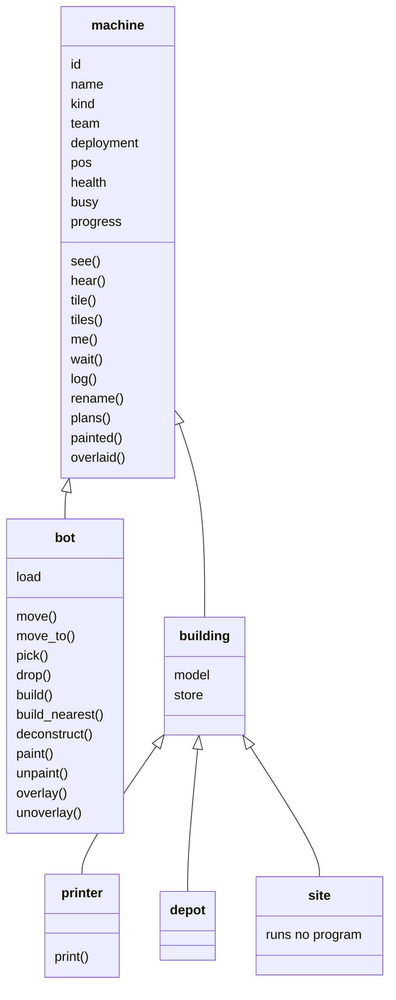

# 02 — Machines

What a machine is, what it senses, and what it does. A machine has a
program, a team, a kind and a name; it senses passively through two shared
senses and acts through a handful of builtins, every one of which is a row in
the cost table. This doc is what the game half of the language crate is built
from, and it is normative: two implementers reading it must produce the same
tick-by-tick behavior (design-invariant DI7). The language itself is
[01-language](01-language.md); this doc names the builtins that language
calls the game's own.

## Decided

Rulings this doc owns, moved here from the overview when it was written.
Q22's is shared with `docs/03`, which will cite it. Where a ruling says
"role", this doc says **deployment**, the name Q24 settled on.

- **A machine senses by vision and by sound, and everything sensed is shared
  across its team's machines (Q7).** Machines come in kinds — `bot`, and
  several kinds of building — and each has a vision range and a hearing
  range, tuning constants in data. Distance is squared Euclidean in `num`
  against a squared range. Vision is state: a machine sees what is within
  its range and in line of sight, and `docs/03` pins what blocks sight and
  the ray-walk. Sound is a record of events: a noisy action emits a sound at
  the actor's position with a loudness from its cause, heard by any machine
  whose hearing range plus that loudness covers the distance, through
  terrain, and a hearing query returns the previous tick's sounds. A query
  from any machine returns the union of what every machine of its team
  senses, each thing once, sightings sorted by distance then entity id and
  sounds by distance, position and cause. The live list is computed at query
  time from the world and never stored, so the state hash carries none of
  it; what the colony *remembers* is Q21's table, which is stored. A sighting
  carries the sighted machine's attributes as this doc defines them; a sound
  carries its cause, position, loudness and tick, never its emitter. Whether
  a sound can also interrupt a program was Q16, which ruled it cannot:
  programs poll.
- **Bots are printed by a printer, buildings are built by bots, and a match
  starts with one printer per team (Q9).** There is no fixed roster.
  Production is ordinary program behavior: the printer is a building whose
  program calls `print` with the deployment the new bot runs, and a bot's
  program calls `build` with a building kind and a tile. All bots are one
  kind; what differs is the deployment. A print takes time and, as Q23
  amended, costs nothing else; a build takes time and costs resources, and
  one the machine cannot afford is a `ValueError` fault. A printed bot
  appears on a tile adjacent to the printer on the tick the print completes,
  running its deployment's current bundle from the top; printing a
  deployment with no bundle is a fault. The opening program set is the
  command log's first entries, one deploy per deployment agreed for tick 0;
  a machine whose deployment has no bundle runs the empty program, which
  restarts once per tick and is not a state. The building list is this doc's
  table.
- **The colony remembers tiles, not machines (Q21).** The world is a grid of
  tiles, and for each team every tile is unknown, visible, or remembered as
  it was on the tick it was last seen. A remembered tile holds the terrain
  and any building on it with its attributes, and the tick — never a bot,
  which is only ever a live sighting. After every machine's slice and before
  the tick's state hash, the sim computes each team's visible tiles and
  refreshes their snapshots, so a tile that leaves vision keeps its last one.
  Memory has no expiry and belongs to the team: nothing clears it until the
  match ends, a destroyed building stays remembered until its tile is seen
  again, and sound is never remembered. A tile query returns the live tile if
  visible, the snapshot with its tick if remembered, and nothing at all if
  unknown; tiles sort by row then column. The memory table, per team and per
  tile, is the first sensing data in the state hash. `03` says what a tile
  and its terrain are; `06` places the pass in the tick loop.
- **One resource today, gathered by bots from deposits that regrow, carried
  to buildings that hold it, and spent from where it is held (Q22).**
  Resources are a table keyed by kind, holding `ore`, and every capacity,
  cost, load and deposit amount is a map from kind to `num`, so a second
  resource is a data row. Deposits are terrain with an amount, a cap and a
  regrowth rate per tick, remembered by Q21 as last seen. A bot has a
  capacity and a load, `pick`s from an adjacent deposit or depot and `drop`s
  into an adjacent building, and carries while doing anything else. Every
  building has a store with a capacity per kind: the printer's is zero, since
  Q23 made prints free; the **depot** is a building whose store is large and
  whose purpose is to hold. A `build` places a site with a store whose
  capacity is the building's cost; bots fill it, construction runs for the
  build time, and the building appears with an empty store. Nothing starts
  stocked and nothing spends from a store it does not own; ore goes into
  sites and depots only. The building list holds printer and depot; the
  numbers are tuning in data; `03` defines deposits and places them.
- **Printing costs time only; building costs resources (Q23).** A printer
  prints one bot per print time and consults no store; a `drop` into a
  printer is a fault. A second printer costs ore to build, so the economy
  bounds the fleet one step removed. Q9's priced print and Q22's opening
  stock and printer store are withdrawn; Q23's own bound, printers and time,
  is replaced by Q24's cap.
- **Every machine has health; damage lowers it; zero is `dying`, the
  threshold below is `death`; a fault costs one health; a team may have ten
  bots per printer, and each printer unlocks a deployment (Q24).** Health is
  a `num` per machine, starting at the kind's maximum, never regenerating by
  itself; sites have it too. Damage is the one mechanism, and today's one
  cause is the `fault` prologue, which charges one health beside the record
  it writes, so a fault-restart loop is finite. `dying` is raised at the
  boundary where health reaches zero or below; `death` directly when health
  reaches the kind's death threshold, a negative number in data, or when the
  tile is destroyed. A dying machine's health is frozen. A team's bot cap is
  its printers times `bots_per_printer`, sites excluded; a `print` at the
  cap is a fault; losing a printer lowers the cap and bots above it are kept.
  A team has one bot deployment per printer, named from a color list in
  data in order, plus one deployment per building kind, not counted; losing
  a printer locks the last unlocked deployment, whose bots keep running until
  they die. What deals damage beyond a fault is Q25.

## A machine

Every machine has exactly these four things, and nothing else about it is
identity:

| | Is | Set |
|---|---|---|
| **kind** | `"bot"` or `"building"`; a building also has a **model** — `"printer"`, `"depot"` or `"site"` | at print or build, never changed |
| **team** | the allegiance it acts for, a small integral `num`; every machine of a team shares senses, memory, stores, deployments and the bot cap | at print or build, from the machine that made it; never changed |
| **program** | the bundle of its **deployment**: a bot runs the bundle deployed to its color, a building the bundle deployed to its model's name | by the command log, through the deployment (Q11) |
| **name** | a `str` of at most `name_max` scalars, for the player's eyes and the log; not identity, not unique, and never read by the sim | at print or build, to the deployment's name plus the entity id; changed by `rename` |

Two machines with the same team, kind and deployment are the same program in
two bodies, which is Q2's fleet; what tells them apart is the entity `id`,
which the sim assigns and never reuses.

### Deployments

A **deployment** is a named slot that holds a bundle. Deploying (Q3) writes a
bundle into a slot; every machine on that slot takes the new bundle at its
next operation boundary (Q11).

- **Bot deployments are colors**, from the list `deployment.colors` in
  [data/machines.toml](../data/machines.toml), in order. A team has as many
  as it has printers: its first printer unlocks the first color, its second
  the second. A `print` names the color the bot runs.
- **Building deployments are models**: `"printer"` and `"depot"` are
  deployments, one per team, unlocked from the start and never locked. A
  site runs no program and has no deployment.
- **Locking.** Losing a printer locks the team's last unlocked color. Bots on
  a locked color keep running its bundle until they die; `print` of a locked
  color is a `ValueError`; a deploy to a locked color is accepted into the
  command log and takes effect when the color unlocks again.
- **The opening program set** (Q9) is one deploy per deployment the team's
  starting bundles name, agreed for tick 0.

## Kinds

Every kind and model is a row in [data/machines.toml](../data/machines.toml)
with the numbers below. The list is closed; a new model is a new question
number. The kinds form a tree: what every machine has and does sits at the
root, bots and buildings split below it, and the building models are leaves.

A field is an attribute every machine of that kind carries; a name with
parentheses is a builtin its program may call. Everything at the root is
shared by every kind, so a printer senses exactly as a bot does and a site
carries a team and a position like any building.

| Model | Moves | Store | Made by | Does |
|---|---|---|---|---|
| `bot` | yes | none; a **load** up to its capacity | a printer, in `print_ticks`, under the team's cap | senses, moves, picks, drops, builds |
| `printer` | no | capacity zero | a bot's `build`, for `cost` in `build_ticks`; one per team at match start, placed by the map (`03`) | senses, prints; unlocks a color and ten bots |
| `depot` | no | capacity per kind, large | a bot's `build` | senses, holds |
| `site` | no | capacity equal to the cost of what it becomes | a bot's `build`, at once | holds; becomes its building when full and built |

A **site** is a building for every purpose but one: it has a team, a tile, a
store, ranges and health, and appears in sightings and memory like any
building, but it runs **no program** and has no deployment until it
completes. `docs/03` says which tiles may be built on.

## A machine's attributes

The attributes are what a sighting carries (Q7), what a remembered tile
holds for a building (Q21), and what `me()` returns for the machine itself.
Every attribute is readable by a program as a field of the record; none is
writable except through an action.

| Attribute | Type | Holds |
|---|---|---|
| `id` | `num`, integral | the entity id, unique for the match, never reused |
| `name` | `str` | the machine's name |
| `kind` | `str` | `"bot"` or `"building"` |
| `model` | `str` | `"bot"`, `"printer"`, `"depot"` or `"site"` |
| `team` | `num`, integral | the team's number |
| `deployment` | `str` or `None` | the color or model name whose bundle it runs; `None` for a site |
| `pos` | `(num, num)` | the tile it occupies, as `(x, y)`, integral |
| `health` | `num` | current health; the model's maximum is in data |
| `busy` | `str` or `None` | the action in progress — `"move"`, `"pick"`, `"drop"`, `"print"`, `"build"`, `"wait"` — or `None` |
| `load` | `dict` of kind to `num` | a bot's carried resources, every kind present; absent on a building |
| `store` | `dict` of kind to `num` | a building's held resources, every kind present; absent on a bot |
| `progress` | `num` | ticks remaining on `busy`, or on a site's construction; `0` when idle |

**Occupancy.** A tile holds at most one machine. A bot cannot move onto an
occupied tile, a print needs a free adjacent tile, and a build needs a free
tile.

**Adjacency** is the four tiles sharing an edge, `(x, y±1)` and `(x±1, y)`.
Every rule that says "adjacent" means those four. North is `+y` and east
is `+x` (`03`), and "row then column" means north to south, then west to
east.

## Senses

Sensing is **passive**: every machine sees and hears every tick without
doing anything, and the queries below read what the whole team senses now.
Two queries, two more that read the colony's memory, and three that read the
team's plans and marks (Q10, Q26, Q27). All of them return
lists or records sorted as Q7 and Q21 rule, computed when called, and cost
their `[game]` row plus `factor.traverse` per element returned
([costs](01-language/costs.md)).

| Query | Returns |
|---|---|
| `see()` | a list of **sightings**: every machine any of the team's machines sees now, each once, sorted by squared distance from the calling machine then by `id`. A sighting is a machine's attribute record. The team's own machines are always included. |
| `hear()` | a list of **sounds** emitted during the previous tick that any of the team's machines hears, each once, sorted by squared distance from the calling machine, then by position, then by cause. A sound is a record `cause`, `pos`, `loudness`, `tick`. |
| `tile(x, y)` | the tile's record for the team — `state` one of `"unknown"`, `"visible"`, `"remembered"`; `terrain` as `03` defines it; `building` a machine record or `None`; `seen_at` the tick; `paint` and `overlay`, the tile's realised marks, and `plans`, the team's pending plans by kind, as `03` defines them, present whatever the state — or `None` for an unknown tile. A visible tile is the world now; a remembered one is its snapshot. |
| `tiles(x0, y0, x1, y1)` | the records of every tile in the rectangle that is not unknown, sorted by row then column. |
| `me()` | the calling machine's own attribute record. |
| `plans(kind)` | the team's pending plans of `kind` — `"paint"`, `"overlay"` or `"building"` (Q27) — as `(x, y, value)` tuples, sorted by row then column; the value is a color, a label or a model, or `None` for a plan to clear. |
| `painted(color)` | every tile the team sees or remembers whose paint is `color` — paint is the tile's, not a team's (Q28) — as `(x, y)` tuples, sorted by row then column. |
| `overlaid(label)` | every tile the team sees or remembers whose overlay is `label`, as `(x, y)` tuples, sorted by row then column. |

**Vision** (Q7): machine `u` sees a machine at `q` if
`dist²(u.pos, q) ≤ vision²` for `u`'s model and the line of sight from
`u.pos` to `q` is clear, by `03`'s ray-walk. **Hearing**: `u` hears a sound
at `s` with loudness `L` if `dist²(u.pos, s) ≤ (hearing + L)²`. Both ranges
are per model in data.

### Sounds

Every action below that is marked *noisy* emits a sound at the actor's
position on the tick the action **begins**, with the loudness its row gives.
The causes, which are the `cause` strings a sound carries:

| Cause | Emitted by |
|---|---|
| `"move"` | a bot beginning a move |
| `"pick"`, `"drop"` | a bot beginning a pick or a drop |
| `"print"` | a printer beginning a print |
| `"build"` | a bot placing a site, and a site completing |
| `"deconstruct"` | a bot beginning a deconstruction |

Loudness per cause is in `data/machines.toml`. A sound never names its
emitter.

## Actions

A machine acts by calling an **action builtin**. An action is a **waiting
operation**: the builtin checks its preconditions, begins the action, and
the machine then yields at the boundary after it until the action completes
— `progress` counting down one per tick — after which main flow continues
with the builtin's return value. Interrupts are delivered at the boundaries
inside the wait as at any other, and a `fault` or `redeploy` epilogue
**cancels** the action in progress: the machine is idle when its program
restarts, and a cancelled pick, drop or build has transferred nothing.

A machine does one action at a time. Calling an action builtin while `busy`
is not `None` is a `ValueError`. A precondition that fails is a `ValueError`
raised before anything begins, so a failed action has no effect and emits no
sound.

| Action | Who | Does | Takes | Noisy |
|---|---|---|---|---|
| `move(dir)` | bot | `dir` one of `"n"`, `"e"`, `"s"`, `"w"`; the target tile must be passable (`03`) and unoccupied at the moment the move begins; the bot is on the target tile when the move completes, and occupies **both** tiles meanwhile for occupancy purposes | `move_ticks` | yes |
| `move_to(x, y)` | bot | **one step** toward `(x, y)`: of the adjacent tiles that are passable and unoccupied, the one with the least squared distance to `(x, y)`, ties in the order `n`, `e`, `s`, `w`; a `ValueError` if none qualifies or the bot is already there. A program that wants to arrive loops; there is no pathfinding, and a bot can be led into a dead end | `move_ticks` | yes |
| `pick(kind)` | bot | from an adjacent deposit or depot — the nearest by squared distance, ties by lower `x` then `y` for deposits and lower `id` for depots, deposits before depots — take `min(pick_rate, available, free capacity)` of `kind`; the transfer happens when the action **completes**; a result of zero is a `ValueError` before it begins | `pick_ticks` | yes |
| `drop(kind)` | bot | into the adjacent building or site with the most free capacity for `kind`, ties by lower `id`, transfer `min(load, free capacity)` on completion; a printer never qualifies; nothing adjacent with free capacity is a `ValueError` | `drop_ticks` | yes |
| `print(color)` | printer | `color` must be an unlocked deployment with a bundle (Q9, Q24), the team must be under its bot cap, and a free adjacent tile must exist at completion — the first free of `n`, `e`, `s`, `w`; the bot appears there, on the printer's team, named `color` plus its `id`, in main flow, its first slice next tick; no free tile at completion cancels the print with nothing produced | `print_ticks` | yes |
| `build(model, x, y)` | bot | `model` a building model other than `site`; `(x, y)` adjacent and buildable (`03`): `ground`, no deposit, **no building** — a tile carrying the team's building plan for `model` (Q27) is the usual target, and if that tile has a building the plan deconstructs it first (Q28), as one action of both durations; placing the site consumes the plan and no other mark. The site appears at once, on the bot's team, named `model` plus its `id`, with an empty store of capacity `cost[model]`. When the site's store reaches its capacity, construction runs `build_ticks[model]` and the site becomes the building, with `deployment` the model's name and an empty store | `0`, or `deconstruct_ticks` of the old building first — the site is busy after that | yes, twice |
| `paint(x, y)` | bot | `(x, y)` adjacent and carrying the team's paint plan with a color; if the tile is already painted, the unpaint runs first (Q28), as one action of both durations; on completion the tile's paint is the plan's color and the plan is gone; no plan is a `ValueError` | `paint_ticks`, plus `unpaint_ticks` if painted | no |
| `unpaint(x, y)` | bot | `(x, y)` adjacent and painted; on completion its paint is `None`. Any team's bot may do it. A paint plan whose value is `None` is realised by this action and consumed | `unpaint_ticks` | no |
| `overlay(x, y)`, `unoverlay(x, y)` | bot | as `paint` and `unpaint`, for the overlay slot | `overlay_ticks`, `unoverlay_ticks` | no |
| `deconstruct(x, y)` | bot | `(x, y)` adjacent and holding a building or a site; on completion it is gone — its store lost, and its team's cap and deployments updated as on its death (Q24). Any team's bot may do it. A building plan whose value is `None` is realised by this action and consumed | the model's `deconstruct_ticks` | yes |
| `build_nearest(model)` | bot | as `build`, on the nearest tile to the bot that is buildable and unoccupied, by squared distance, ties by lower `x` then `y`, within `build_reach` tiles; none is a `ValueError` | `0` | yes, twice |
| `wait(ticks)` | any | nothing, for `ticks` ticks, integral and `≥ 1` | `ticks` | no |
| `log(*values, level="info")` | any | appends `str` of each value, joined by spaces, at `level` — one of `"debug"`, `"info"`, `"warn"`, `"error"` — to the machine's diagnostic log, which the renderer shows and which is **not** world state | `0` | no |
| `rename(name)` | any | sets `name`; a `str` longer than `name_max` is a `ValueError` | `0` | no |

**Ordering across machines** (determinism rule 6): actions begin in slice
order within a tick (`06`) and complete in entity-id order among those that
complete on the same tick, so two bots picking from one deposit on the same
tick are resolved lower `id` first.

## Health, damage and the interrupts

Every machine has **health**, a `num` from its model's `health` in data down
to nothing. **Damage** subtracts an amount; nothing adds one back. What
follows depends only on the result:

| Health after damage | Raises |
|---|---|
| above zero | nothing |
| zero or below, above the model's `death_threshold` | `dying`, at the boundary where the damage lands |
| at or below `death_threshold` (a negative number) | `death`, directly |

A machine already in `dying` has its health **frozen**; further damage of its
own making — a fault in `on_dying` — escalates as the language rules and
deals nothing. A tile is never destroyed (`03`), so damage is the only
cause of `death` today.

The causes of damage today are one. **A fault costs `fault_damage`
health**, charged by the `fault` prologue beside the record it writes, so a
program that faults on every restart dies after `health / fault_damage`
faults instead of looping forever. Every other cause — an attack, a turret,
terrain, the opposition — is Q25's, and the attribute table gains what that
ruling needs when it is made.

[01-language](01-language/execution.md) fixes what each interrupt does to
*execution*. This table fixes what it does to the machine's **body**, which
is what the prologues and epilogues do beyond the language's rules.

| Kind | Raised by | Prologue does to the body | The hook may | Epilogue does to the body |
|---|---|---|---|---|
| `death` | health at or below the threshold; `dying`'s epilogue | nothing | — | removes the machine; its load or store is lost; its tile is free; a site it was building stays; the team's cap and deployments update if it was a printer |
| `dying` | health at or below zero | cancels the action in progress; freezes health | call the senses, `log`, `wait`, `rename`, and `drop`; any other action is a `ValueError` | nothing beyond raising `death` |
| `fault` | the program | cancels the action in progress; charges `fault_damage` | anything | nothing beyond the restart |
| `redeploy` | the command log | cancels the action in progress | — | nothing beyond the swap |

## Game modules and builtins

The closed module set (Q13) is the bundle's own files plus the game's
modules. **There are no game modules yet**; every builtin above is a global
name, and a bundle file named `game.py` or the like collides with nothing.
There are no root or trigonometric builtins; a program that needs one writes
it.

## Costs

Every builtin above has a row in the `[game]` table of
[data/language/costs.toml](../data/language/costs.toml), in the shape
[costs](01-language/costs.md) fixed: a base cost, plus `factor.traverse` per
element for a query that returns a list. An action's base cost is charged
when it begins; its wait costs nothing, since the program is paused.

## What this doc leaves open

- **Q25**: combat — what deals damage beyond a fault, whether bots attack,
  whether a building defends, and whether anything repairs.
- **Further models**: a building that extends senses, a second bot model, a
  second resource. Each is a new question number and a row here.
