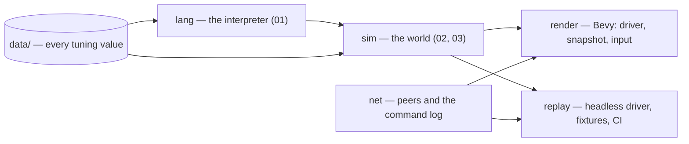

# 06 — Architecture

The crates, the driver, the tick loop, the command log, the snapshot and
the testing strategy: how the pieces the other docs specify are arranged
into a program that runs the same on every peer. This doc is normative for
everything that crosses a crate boundary or decides when a tick runs; two
implementers reading it must produce the same state hash on every tick
(design-invariant DI7).

## Decided

Rulings this doc owns, moved here from the overview when it was written.

- **The game is lockstep multiplayer, and `sim` is renderer-free plain
  Rust** — the two facts fixed before any question was asked, restated from
  the overview because every rule below follows from them.
- **The sim has no rate; the players choose the speed together (Q6).** A
  tick is the unit of simulated time and every duration is a count of ticks.
  How many ticks pass per real second is a `SetSpeed` command in the log,
  agreed for a tick like a deploy, applied by each peer's driver and never
  read by the sim, from a closed list of steps in data with `0` as pause;
  the map sets the starting speed. The renderer interpolates between
  completed ticks.
- **The player may mark the map, and everything the player does enters one
  ordered command log (Q10, as amended by Q26, Q27 and Q28).** Besides
  `Deploy`, the log carries `Mark` and `Unmark`, which place and withdraw
  plans that only a bot makes real, `SetSpeed` (Q6) and `Resign`, which
  removes the sender's team on the agreed tick. A mark changes what a
  program can read about a tile and never what a machine does: the player
  authors programs and marks the map, and never commands a machine. Every
  command carries its sender and its tick; one that cannot apply is dropped,
  except a deploy to a locked deployment, which waits. What a mark is and
  does is [02-machines](02-machines.md)'s and [03-world](03-world.md)'s.
- **A fixed delay, and a stall for a late peer (Q12).** A command entered at
  tick `t` is agreed for `t + delay`, a tuning constant in ticks fixed at
  match start; a peer missing another's command set for the next tick issues
  no tick until it arrives, so nothing is dropped and nothing desyncs.
  Single-player is lockstep with one peer and feels the same delay. Within a
  tick, commands apply by sender then submission order. Rate-limiting is
  deferred with PvP; the sender stamp is its hook.
- **A paused driver still reaches a command, and a hook's wait spends its
  budget (Q32).** At speed `0` the driver runs, without the clock, exactly
  the ticks up to the next one that carries any command, so a `SetSpeed`
  above zero lands and resumes; `delay` and `stall_report_ticks` live in
  `data/net.toml`. The hook half is [01-language](01-language/execution.md)'s.
- **Bevy renders, in its own crate, in the sim's process, reading only
  completed-tick snapshots and writing only to the command log (Q15).** A
  `render` crate depends on `sim` and Bevy; `sim` depends on neither. The
  driver — wall clock, speed, peer wait, next tick — is a Bevy system that
  owns the sim as a resource; every other system sees only the snapshot the
  sim publishes after each tick, from which the renderer's own entities are
  built. Interpolation is in floats and never read back. Input becomes
  commands the renderer submits and forgets. Headless — `sim` plus a driver
  with no Bevy — stays the build CI runs.

## Crates



| Crate | Depends on | Owns | Floats |
|---|---|---|---|
| `lang` | nothing | the interpreter [01-language](01-language.md) specifies: the loader, the evaluator, the interrupt machinery, `num` | none |
| `sim` | `lang` | the world: tiles, machines, the tick loop, the state hash, the snapshot; the game builtins `02` names, which it registers with `lang` | none |
| `net` | `sim`'s command types only | the command log as a data structure and its exchange between peers: stamping, the per-tick sets, the stall | none in anything it sends |
| `render` | `sim`, `net`, Bevy | the driver, the ECS built from snapshots, interpolation, input, the mark tools, the log view | yes, and only here |
| `replay` | `sim`, `net` | the headless driver: runs a `(map, command log)` to a hash stream; the golden fixtures; the determinism suite; the cross-architecture check | none |

**The arrow that does not exist** is any edge into `sim` or `lang` from
`render`. The compiler enforces it: `sim` has no `render` dependency, and a
`render` type cannot appear in a `sim` signature. The review rule CLAUDE.md
states — flag any code that feeds sim state from the ECS side — covers what
the compiler cannot see: a `render` system holding a mutable reference to
the sim resource outside the driver.

**`lang` is separate from `sim`** so the determinism suite can run the
interpreter on its own fixtures (T14) without a world, and so the
`arithmetic_side_effects` lint reaches it as a workspace member.

## The driver

The driver is the loop that decides when a tick runs. Two exist — the Bevy
system in `render`, and the headless one in `replay` — and they share one
contract:

```text
loop:
    if speed == 0:
        T = net.next_tick_with_a_command(tick)   # lowest T > tick whose sets are not all empty
        if T is None: wait for a command; continue
        if not net.have_all_sets(tick + 1 ..= T): stall; continue
        # run the ticks up to T without consulting the clock (Q32)
    else:
        wait until (real time since last tick) ≥ 1 / speed
        if not net.have_all_sets(tick + 1): stall; continue
    commands = net.sets_for(tick + 1)            # every peer's, ordered
    sim.step(commands)                           # exactly one tick
    snapshot = sim.snapshot()                    # published, never shared
    hash = sim.hash()                            # sent to peers, checked
    tick += 1
```

- **`sim.step` is the only entry point that changes the world**, and it
  takes the tick's full command set. There is no other mutating call on the
  sim; the snapshot and the hash are reads.
- **Speed lives in the driver**, set by the `SetSpeed` command when
  `sim.step` reports it applied. The sim carries no rate (Q6). **A paused
  driver still reaches a command** (Q32): at speed `0` it runs, without the
  clock, exactly the ticks up to the next one that carries any command —
  which is how a `SetSpeed` above zero lands on its agreed tick and resumes.
- **The stall** (Q12) is the driver refusing to call `sim.step` until every
  peer's set for the next tick is in hand. The renderer keeps drawing the
  last snapshot. After `stall_report_ticks` (`data/net.toml`, beside
  `delay`) of real time at the current speed, the driver reports the absent
  peer to the player; what the player
  may do then — wait, or resign — is `render`'s UI and not a sim rule.
- **Single-player** is the same loop with one peer, whose sets are its own
  and always in hand, so the delay is felt and the stall never fires.

## The tick

`sim.step` runs one tick in this order, and the order is spec:

1. **Apply the tick's commands**, by sender then submission order (Q12):
   `Deploy` writes a bundle into a deployment slot (or waits, if locked);
   `Mark` and `Unmark` set and clear plans (`03`); `SetSpeed` is recorded for
   the driver; `Resign` marks the sender's team **out**, which step 5
   applies.
2. **Every machine's slice**, in ascending entity id: its main flow or
   handler runs until its tick budget is spent or it yields at a restart
   (`01`, Metering), with interrupts delivered at its boundaries. Actions
   begun in a slice begin in this order, and actions completing on this tick
   complete in ascending entity id after every slice has run.
3. **Action completions**, in ascending entity id: moves land, transfers
   happen, prints place bots, sites complete, deconstructions finish (`02`).
   A bot printed this tick has its first slice next tick.
4. **Damage and death**: health changes from this tick's causes are applied
   — attacks that completed, and every printer's defence against adjacent
   enemy bots (Q30) — `dying` and `death` are raised where Q24 says, and
   `death` epilogues remove machines. A machine removed here is absent from everything below.
5. **Out teams**: every team that is out — it resigned this tick, or step 4
   left it with no printer (`04`) — has its machines removed, its plans
   cleared and its log closed, in team order. A printer converted away from
   it this tick is not its and stays.
6. **Regrowth**: every deposit grows (`03`).
7. **The vision pass**: each team's visible tiles are computed and their
   snapshots refreshed (Q21).
8. **The state hash** over everything below.

Nothing else happens in a tick. A rule that needs another step is a change
to this list and a new question number.

## The command log

A **command** is:

| Field | Holds |
|---|---|
| `tick` | the tick it is agreed for: `submitted_at + delay` |
| `sender` | the team submitting it |
| `seq` | the sender's submission counter, for ordering within a tick |
| `kind` | `Deploy`, `Mark`, `Unmark`, `SetSpeed`, `Resign` |
| `payload` | `Deploy`: a deployment name and a bundle (the files, byte-exact — `01`, The bundle); `Mark`: a tile, a plan kind and a value; `Unmark`: a tile and a plan kind; `SetSpeed`: a step; `Resign`: nothing |

- **A tick's set** from a sender is every command of that sender with that
  `tick`, in `seq` order; an empty set is sent explicitly, so absence is
  never ambiguous.
- **Validation at submission** refuses what can never apply — a tile off
  the map, a step not in the list, a building plan naming `printer` (Q31), a
  bundle that fails to load (`01`) — so
  the log holds only commands every peer would accept. A command that
  cannot apply *on its tick* — a `Mark` on a tile the sender has since lost
  the right to, a `Resign` from a team already out — is dropped in
  `sim.step` and recorded nowhere; a `Deploy` to a locked deployment waits
  in the slot (`02`).
- **The log is append-only and complete**: every command every peer ever
  applied, in order — a scripted team's commands (`04`) among them, since
  they enter the log like any peer's. `(map, command log)` is a replay, and
  the log's bytes are hashed into the replay's identity as the map's are,
  each length-prefixed as rule 7 hashes a bundle.
- **Encoding** on the wire and on disk is one canonical byte layout per
  kind, length-prefixed like the bundle hash (`01`), so that the log hashes
  identically everywhere. `net` owns the layout; it is spec once written and
  changes only under a new question number.
- **The opening program set** (Q9) is the first entries: one `Deploy` per
  deployment, `tick` 0, `sender` the team, in team order. A match cannot
  start without them.

## The snapshot

After every tick the sim publishes a **completed-tick snapshot**, a plain
value with no reference into the sim:

| Part | Holds |
|---|---|
| `tick` | the tick just completed, and the speed in force — the driver's number, carried for the renderer, not the sim's |
| `machines` | every machine's attribute record (`02`), plus its diagnostic log entries from this tick |
| `tiles`, per team | every tile's record as that team sees it: state, terrain, deposit, paint, overlay, building, plans, `seen_at` (`03`) |
| `sounds` | every sound emitted this tick, with its cause, position, loudness and tick |
| `faults` | every machine's fault record (`01`) |
| `teams` | each team's deployments, their bundles' versions, its cap, its bot count |

The renderer reads it and builds its own entities; nothing in it is shared
with the sim, and nothing the renderer does to it reaches the sim. It is
also what the replay tool writes out when asked, so a replay can be
inspected without a renderer. The diagnostic log (`02`, `log`) is part of the
snapshot and **not** of the state hash.

## The state hash

The hash is FNV-1a 64-bit over a canonical encoding of the world after step
7, in this order: the tick; every team in order — its deployments, the
version of each bundle, its cap, its plans by tile in row-then-column order,
its memory table by tile; every tile in row-then-column order — terrain,
deposit, paint, overlay; every machine in ascending entity id — every
attribute, its load or store, its health, its action in progress and
`progress`, its fault record, and its **execution state**: the program
counter, every frame's locals, every global, the deficit, the pending
interrupt set, whether it is in main flow or a handler and which kind, the
hook budget spent so far in that handler, and the set of modules already
run in this run (`01`). Every `num` is
its i128; every `str` its UTF-8 bytes length-prefixed; every collection its
elements in iteration order.

What is **not** hashed: the diagnostic log, the speed (the driver's, not the
sim's), anything the renderer holds, and the live sensing list, which is a
function of the world rather than part of it (Q7).

Two peers whose hashes differ on a tick have desynced. `net` reports it, the
driver stalls, and the replay tool reproduces it from `(map, command log)`
on either peer — which is the whole reason the log is complete.

## Testing

Every layer has a determinism gate, and every gate refuses to score green
on a run that did not run (CLAUDE.md):

| Gate | What it checks | Where |
|---|---|---|
| golden replays | `(map, command log) → hash stream` against a checked-in stream; a changed hash must be explained in the PR | `replay`, T7 |
| language fixtures | program → transcript hash, cross-process | `lang`, T14 |
| the source scan | no floats, no hash-order iteration, no wall clock, in `lang`, `sim`, `net` | `sim/tests/no_floats.rs`, widened to the workspace |
| cross-architecture | `scripts/determinism-battery.sh` on an x86-64 and an arm64 runner, each against the checked-in fixtures, and the two final-hash files diffed | `.github/workflows/ci.yml`, the `determinism` and `cross-architecture` jobs |
| the check on the checks | each gate seeded with a defect it must catch | `scripts/check-checks.mjs`; `--rust` seeds the gates above (`scripts/lib/rust-gates.mjs`), run from the Rust half of `scripts/ci.sh` |

`render` has no determinism gate, because it has no determinism to keep;
its test is that it builds with `sim` unchanged.

## What this doc leaves open

- **Map generation** from a seed, as a deterministic function in `sim`
  (`03`); a question when wanted.
- **Persistence** — saving a match to resume it — which is a snapshot plus
  the log to that tick, and a question when wanted.
